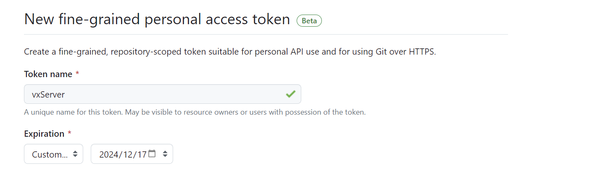
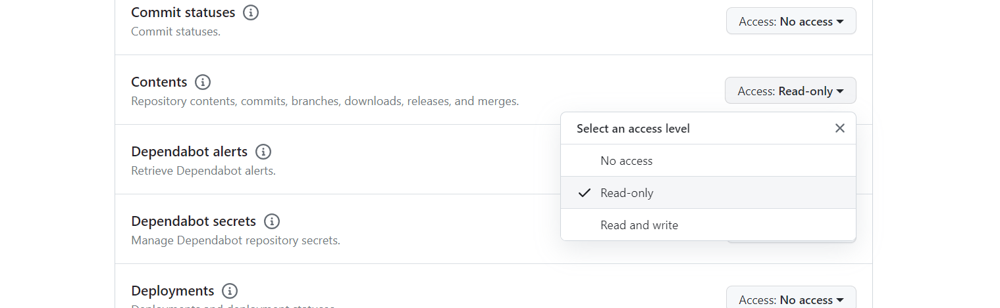
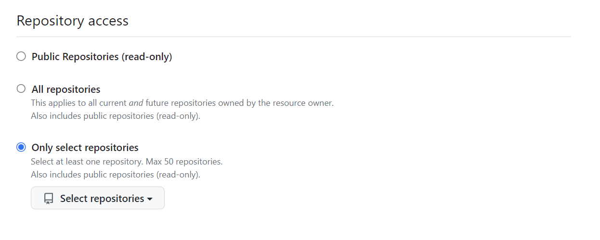
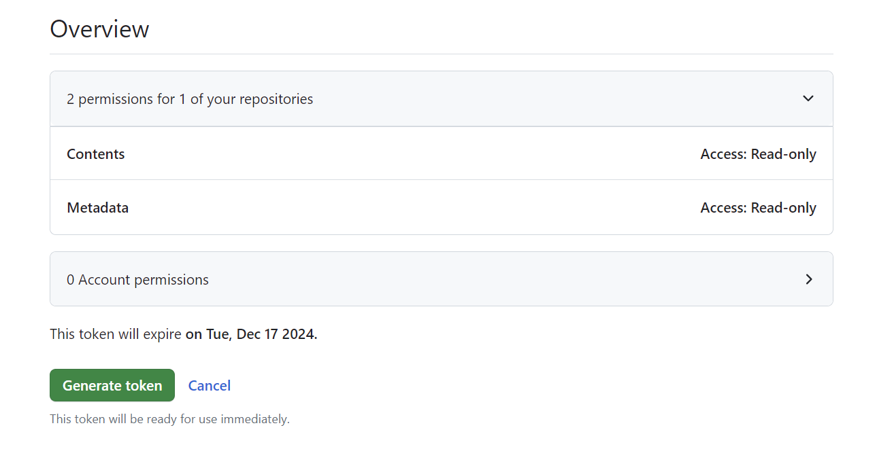

# 微林 - 静态托管

## 介绍
静态托管服务用于帮助将您的 Github 仓库作为 Web 发布。

## 申请 Github Fine-grained Token
1. 登录 Github，进入 [Settings](https://github.com/settings/tokens?type=beta) 页面

2. 创建新的 Token。
   * Token Name：您喜欢的名称
   * Expiration：最长只能选择一年，记得在过期之前更新回来更新 Token
   * 

1. 选择需要的权限，这里只需要在 Contents 里面勾选 Read-Only。
   

4. 选择授权的仓库，这里只需要选择您需要托管的仓库。

5. 点击最下方的 Generate Token，生成 Token。
   
