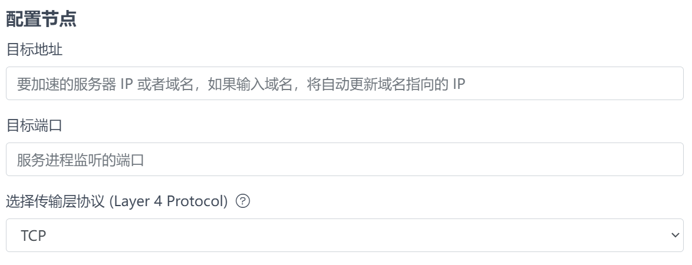

# 微林 - 流量加速服务
非常感谢您了解微林的流量加速服务，我们尽量使用通俗易懂的语言来描述这个服务，希望您能够理解并使用这个服务。  
本知识库与官网的内容稍稍不同，我们假定您刚刚接触到本服务，会尽可能全面的解释所有概念。  

# 导入概念
当您需要访问某个网站时，需要输入网址才能访问。
比如您想访问微林的官网，您需要输入  `https://www.vx.link`  才能访问。我们可以从这个网址中提取出两个概念，它们分别是传输协议和域名。现在让我们来看看这两个概念的定义。

## 传输协议
传输协议是一种规则，它规定了数据在网络中如何传输。
比如 https 协议，它是 http 协议的安全升级版，它通过加密 http 明文流量，保证了数据在传输过程中的安全性。

## 域名
域名是一种面向人类友好的 IP 地址索引服务，通过可读性高的字符串来将可读性差的 IP 地址关联起来。  

# 传输协议，但是更高级
现在我们知道 https 是 http 协议的升级版，它传输的数据是加密后的 http 数据，实际上最终也要还原成 http 数据才能被浏览器解析。那么，在 https 上，是否还有类似的更上层的协议呢？答案是肯定的。

我想您一定听说过 OSI 7 层网络模型。它是一个网络协议的分层模型，它将网络协议分为了七层，从下到上分别是：物理层、数据链路层、网络层、传输层、会话层、表示层、应用层。在实际应用中，到系统层级，我们一般只使用到了应用层和传输层。也就是说，主要的网络层级是物理层、数据链路层、网络层、传输层、应用层。一共五层。

http(s) 运行在应用层，它的上一层，是运用广泛的传输层协议 TCP。
现如今，几乎绝大部分的网络相关的程序都使用 TCP 协议来传输数据，不过传输层还有另外一个协议，称之为 UDP 协议，主要是对实时性要求比较高的应用场景，比如游戏，语音通话等。

在创建流量加速服务的连接点时，您需要设定传输层协议，默认是 TCP 协议。当然，也可以支持 UDP 协议。  

如果您不知道您的应用程序使用的是 TCP 还是 UDP 协议，那么大抵就是以 TCP 协议来工作的。
几乎不会有应用程序能运行低于传输层的协议，因为这些协议都是为了解决网络传输中的问题而存在的，而应用程序是运行在网络之上的，所以应用程序不需要关心这些问题。

也就是说流量加速服务可以处理几乎所有应用程序的数据流量。

## 端口
在上面的图中，您应该还看到了端口。这是什么呢？该怎么填呢？

端口是一种用于标识网络应用程序的机制。每个运行在计算机上的应用程序都可以打开一个或多个端口，以便通过网络接收和发送数据。

端口是一个数字，它位于IP地址后面，由一个冒号分隔。例如，访问一个网站时，通常使用 HTTP 协议和端口号80，因此网址可能是类似于 http://www.example.com:80 的形式。不过，为了方面大家记忆，浏览器一般都省略了端口号，因此网址通常是 http://www.example.com 的形式。

端口范围从0到65535，其中一些端口号已经被预留给特定的服务和应用程序，例如HTTP服务使用端口80，SMTP服务使用端口25等等。端口号通常被定义在应用程序中，以确保它们不会与其他应用程序冲突。

IP 和端口，就相当于大楼和门牌，您同时需要知道大楼的地址和门牌号才能找到您想要的房间（应用程序）。

一些常见服务的端口号如下：
* ssh : 22
* smtp : 25
* http : 80
* https : 443

您在服务端启动一个服务程序之前，肯定也是需要填写要运行在哪个端口上的，通常会需要在配置文件中填写端口号。不过很多程序也会有默认的端口号，不填写的话，会以默认的端口号来运行。

# 使用连接点
当您创建了一个流量加速连接点后，您就可以将这个连接点设置入口，以更快的速度连接到您的服务器了。